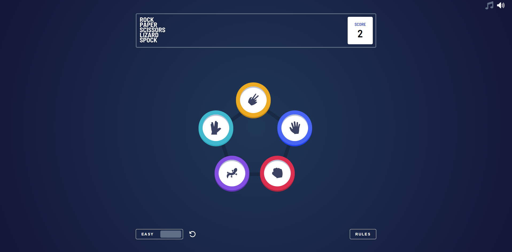
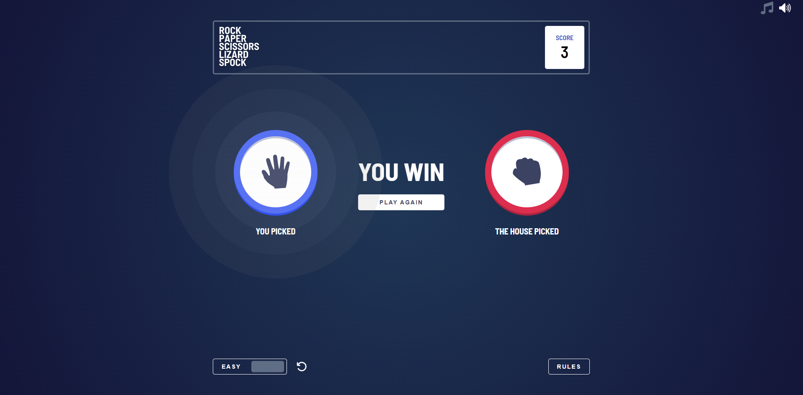
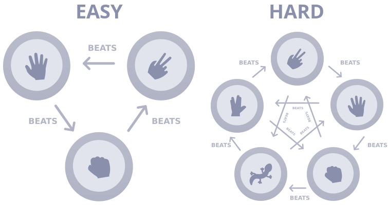

# Rock, Paper, Scissors game




## Overview

This Rock, Paper, Scissors game allows players to play against the computer. There are two difficulty modes available:

- Easy mode, which is the traditional Rock, Paper, Scissors game.
- Hard mode, which is an expanded version called Rock, Paper, Scissors, Lizard, Spock that was created by [Sam Kass and Karen Bryla](https://bigbangtheory.fandom.com/wiki/Rock,_Paper,_Scissors,_Lizard,_Spock).

The game also includes music and sound effects to enhance the gameplay experience. The score and selected difficulty are saved as localStorage values, allowing players to retain their progress and preferred difficulty even if they close the app and come back to it later.

### Rules

If the player wins, they gain 1 point. If the computer wins, the player loses one point. If it's a draw, noone loses or wins points.



### Built with

- JSX
- Styled Components
- JavaScript (React)
- Framer Motion

## Check it live

[live preview](link)

## Run locally

Clone the project

```bash
  git clone https://github.com/Vj3ko/rock-paper-scissors.git
```

Go to the project directory

```bash
  cd rock-paper-scissors
```

Install dependencies

```bash
  npm install
```

Start the server

```bash
  npm start
```

## Author

<p><a href="https://www.linkedin.com/in/vdizdar/"></a>&nbsp;
